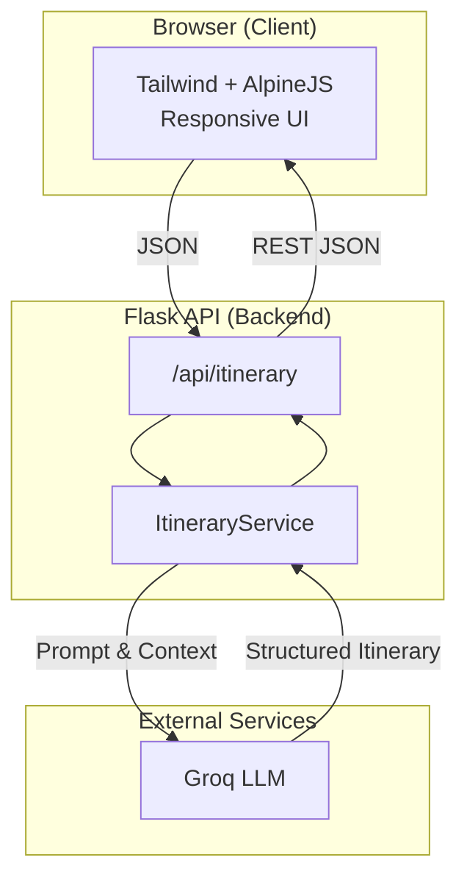
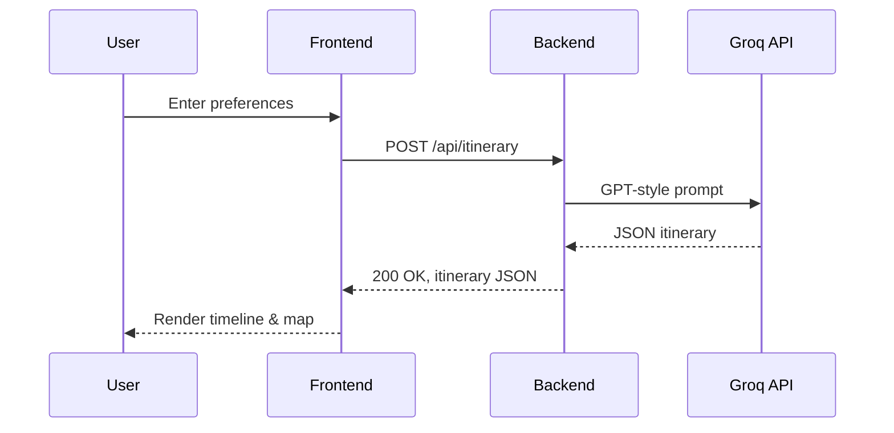

<!--
  _____                           _ _   _               _            _             
 |_   _|                         (_) | (_)             | |          | |            
   | | ___ _ __ _ __   ___  _ __  _| |_ _  ___ ___   __| | ___  _ __| |_ ___  ___  
   | |/ _ \ '__| '_ \ / _ \| '_ \| | __| |/ __/ _ \ / _` |/ _ \| '__| __/ _ \/ __| 
   | |  __/ |  | |_) | (_) | | | | | |_| | (_| (_) | (_| | (_) | |  | ||  __/\__ \ 
   \_/\___|_|  | .__/ \___/|_| |_|_|\__|_|\___\___/ \__,_|\___/|_|   \__\___||___/ 
                | |                                                                 
                |_|                                                                 
-->

# ✈️ Travel Itinerary Planner

AI-powered web application that transforms **your dream destinations and interests into a perfectly curated day-by-day itinerary**, complete with optimal timings, maps, local culture tips, and dining recommendations – all within seconds.

> “It’s like having a local travel expert in your pocket.”

---

## 📜 Table of Contents
1. [High-Level Overview](#high-level-overview)
2. [Live Demo](#live-demo)
3. [Architecture](#architecture)
4. [Key Features](#key-features)
5. [Technology Stack](#technology-stack)
6. [Folder Structure](#folder-structure)
7. [Environment Configuration](#environment-configuration)
8. [API Contracts](#api-contracts)
9. [Extensibility Guide](#extensibility-guide)
10. [Contributing](#contributing)
11. [License](#license)

---

## High-Level Overview
The **Travel Itinerary Planner** leverages natural-language generation to craft personalised travel plans. Users specify:

* Destination city or region
* Trip duration (½-day, 1-day, multi-day)
* Personal interests (e.g., art, food, adventure, nightlife)
* Budget preference

A language-model-powered backend (Groq API) analyses the inputs, combines them with live location metadata, then produces:

| Output | Description |
| ------ | ----------- |
| Full schedule | Time-boxed activities with optimal travel times |
| Interactive map | Visual route with distance & ETA |
| Restaurant picks | Trendy & local-favourite eateries |
| Cultural insights | Etiquette, tipping, dress code |
| PDF export | Shareable offline copy |

---

## Live Demo
<p align="center">
  
</p>

---

## Architecture


### Sequence Diagram


---

## Key Features
* ✨ **AI-Generated Schedules** – Tailored agendas that maximise sightseeing while minimising transit.
* 🗺 **Dynamic Map** – Leaflet.js renders markers & polylines for each stop.
* 🍽 **Foodie Focus** – Curated cafés, street-food stalls, and Michelin gems.
* 📱 **PWA Ready** – Offline support and “Add to Home Screen”.
* 🌐 **Multilingual** – Outputs available in 20+ languages.
* 🔒 **Secure by Default** – Secrets handled via environment variables; no keys stored client-side.

---

## Technology Stack
| Layer | Tech |
| ----- | ---- |
| Front-End | HTML5, Tailwind CSS, Alpine.js |
| Back-End | Python 3.11, Flask, pydantic |
| AI Engine | Groq LLM (gpt-xlarge-1024) |
| Mapping | Leaflet.js, OpenStreetMap Tiles |
| Styling | DaisyUI theme, HeroIcons |
| Tooling | Pre-commit, Ruff, Black |

---

## Folder Structure
```text
travel-itinerary-ai/
├── backend/
│   ├── main.py          # Flask entry-point
│   ├── services/
│   │   └── itinerary.py # LLM prompt orchestration
│   ├── schemas/
│   │   └── itinerary.py # pydantic models
│   └── config/
│       └── config.json  # (optional) local secrets
├── frontend/
│   ├── index.html
│   ├── assets/
│   └── js/
└── README.md            # ← you are here
```

---

## Environment Configuration
The app relies on two critical variables:

| Variable | Purpose |
| -------- | ------- |
| `GROQ_API_KEY` | Auth token for Groq language model |
| `FLASK_ENV` | `development` or `production` |

1. Create a `.env` file **or** set them in your hosting provider’s dashboard.
2. Keep `backend/config/config.json` out of version control – `.gitignore` already does this.

---

## API Contracts
### POST `/api/itinerary`
| Field | Type | Description |
| ----- | ---- | ----------- |
| `destination` | string | City or region name |
| `days` | int | Number of days (1-14) |
| `interests` | list[string] | e.g. `["culture", "food"]` |
| `budget` | string | `low`, `mid`, `high` |

**Response 200**
```jsonc
{
  "city": "Paris",
  "days": 3,
  "itinerary": [
    {
      "day": 1,
      "schedule": [
        { "time": "09:00", "activity": "Louvre Museum", "type": "sight" },
        { "time": "13:00", "activity": "Lunch at Chez Janou", "type": "food" },
        { "time": "15:00", "activity": "Seine River Cruise", "type": "experience" }
      ]
    }
  ]
}
```

---

## Extensibility Guide
1. **Swap LLM provider** – Implement an `LLMClient` interface under `backend/services/llm.py`.
2. **Add weather awareness** – Integrate Open-Meteo API in `ItineraryService` for season-specific plans.
3. **Persistent user accounts** – Plug in Firebase Auth or Supabase.
4. **CI/CD** – Combine GitHub Actions with Railway triggers for zero-downtime deploys.

---

## Contributing
We welcome pull requests for **bug fixes, new prompts, or UI polish**. Before submitting:
1. Create a descriptive issue and discuss design scope.
2. Adhere to existing code style (Ruff & Black handle formatting).
3. Ensure all unit tests pass (`pytest`).
4. Write clear commit messages.

---

## License
Distributed under the **MIT License**. See `LICENSE` for more information.

---

<p align="center">
  <strong>Bon voyage & happy exploring! 🌍</strong>
</p>
